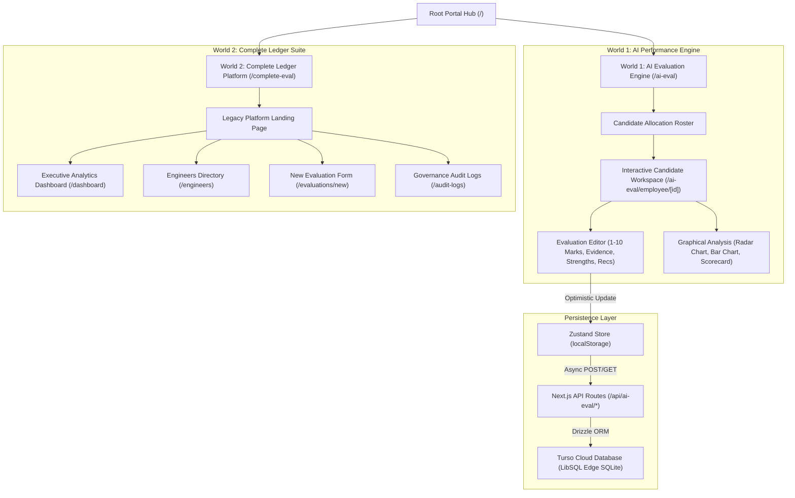
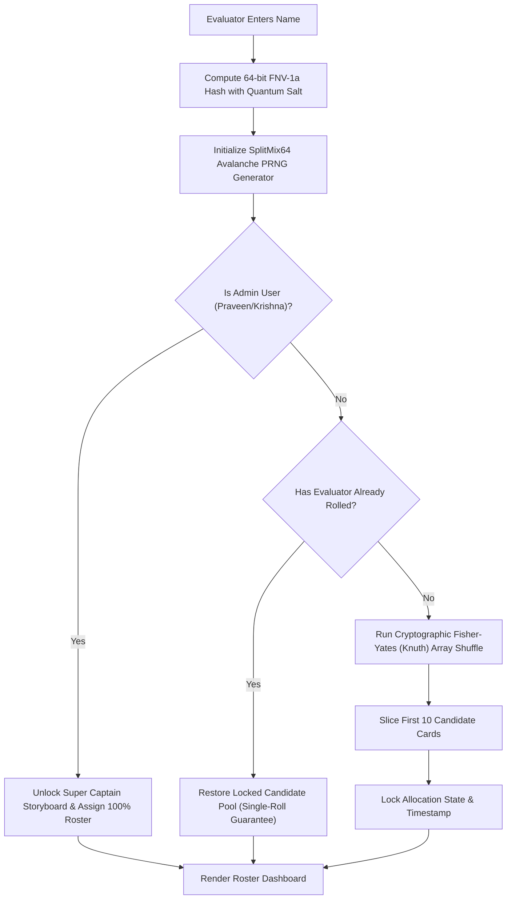
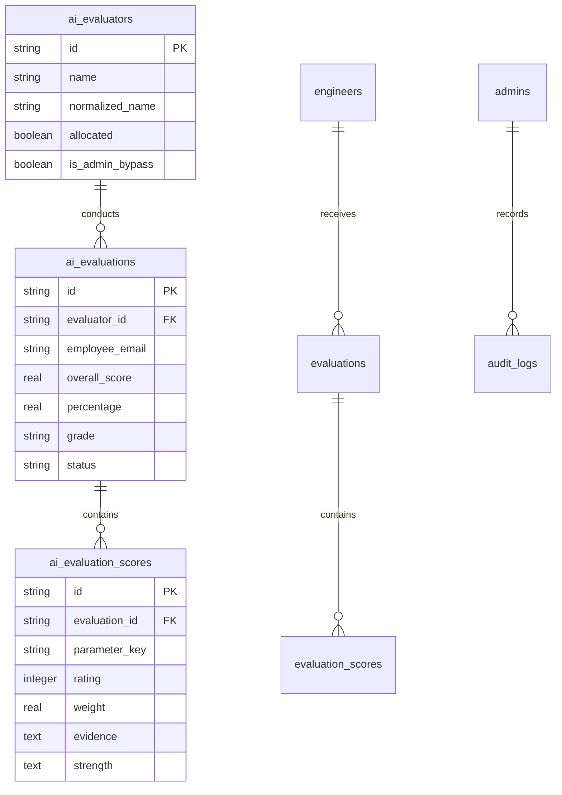

# Wysbryx Intelligence Platform — Dual-World Performance Engine

> **Next-Gen Engineering Performance Intelligence Platform**  
> Transparent, data-driven candidate evaluation engine pairing an **AI Competency Workspace** (World 1) with the **Complete Engineering Ledger** (World 2). Built with Next.js 15, React 19, TypeScript, Zustand, Drizzle ORM, and Turso Edge SQLite.

---

## 📑 Table of Contents
1. [Executive Overview & Purpose](#1-executive-overview--purpose)
2. [Dual-World Isolated Architecture](#2-dual-world-isolated-architecture)
3. [End-to-End User Flow & Sequence Diagram](#3-end-to-end-user-flow--sequence-diagram)
4. [Candidate Allocation Engine & SplitMix64 Algorithm Deep-Dive](#4-candidate-allocation-engine--splitmix64-algorithm-deep-dive)
5. [World 1: AI Evaluation Engine & Rubrics](#5-world-1-ai-evaluation-engine--rubrics)
6. [World 2: Complete Engineering Ledger Suite](#6-world-2-complete-engineering-ledger-suite)
7. [Database & Persistence Architecture (Turso + Drizzle ORM)](#7-database--persistence-architecture-turso--drizzle-orm)
8. [Local Development & Setup Guide](#8-local-development--setup-guide)
9. [Deployment & Environment Configuration](#9-deployment--environment-configuration)

---

## 1. Executive Overview & Purpose

Wysbryx Intelligence eliminates subjective bias, recency bias, and arbitrary scoring in engineering evaluations. The platform adheres strictly to a **Zero-Surveillance Policy**—rejecting keystroke tracking, idle screen monitoring, or camera surveillance—focusing 100% on verifiable deliverables, code quality, AI velocity multipliers, and team mentorship.

### Core Architecture Highlights
* **Dual-World Isolation**: Clear division between **World 1** (AI Performance Engine) and **World 2** (Legacy Ledger Platform).
* **Unpredictable SplitMix64 Single-Roll Distribution**: Candidates are assigned using a 64-bit FNV-1a hash and SplitMix64 avalanche PRNG engine, ensuring statistical randomness with zero permutation bias.
* **Server-Side DB Persistence**: Evaluations update instantly in local state via Zustand optimistic updates while background-syncing to **Turso Edge SQLite** via **Drizzle ORM**.
* **Dynamic Scorecards & Analytics**: Real-time SVG circular gauges, polygon radar contour charts, horizontal marks breakdown, strengths/risks isolation, and hover-enabled evidence review grids.

---

## 2. Dual-World Isolated Architecture



---

## 3. End-to-End User Flow & Sequence Diagram


### Step-by-Step User Role Operating Guidelines

#### 👑 Protocol A: Super Captain Leadership Guide (`Praveen` / `Krishna`)
1. **Access World 1**: Navigate to `/ai-eval`.
2. **Authenticate Leadership Identity**: Type `Praveen` or `Krishna` in the Evaluator Name field.
3. **Verify Match Feedback**: The system displays a `✔ Matched: Praveen` badge with Super Captain indicators.
4. **Enter Executive Command Center**: Click **Continue to Roll**. The system automatically unlocks the **Super Captain Storyboard** modal and bypasses candidate partition limits.
5. **Command & Audit 100% Roster**: Access 100% of all organizational candidates across departments. Click **AI Audit** on any candidate card to grade, write evidence, or certify scorecards.

#### 🎲 Protocol B: Standard Evaluator Single-Roll Guide
1. **Access World 1**: Navigate to `/ai-eval`.
2. **Enter Evaluator Name**: Type your full name in the login input.
3. **Review Single-Roll Lock**: Click **Continue to Roll**. Review the single-roll warning (1 permanent roll per session).
4. **Trigger SplitMix64 PRNG Engine**: Click **Roll Candidate Pool Now**. The avalanche PRNG shuffles and locks a 10-candidate pool for your session.
5. **Audit Assigned Candidates**: Click **AI Audit** on assigned candidate cards to score 6 AI rubrics, record observed evidence, and save scorecards.

---

## 4. Candidate Allocation Engine & SplitMix64 Algorithm Deep-Dive

### The Allocation Problem & Solution
In traditional evaluation systems, evaluators can cherry-pick candidate profiles or suffer from biased workload distribution. Wysbryx solves this using a **Cryptographically Strong SplitMix64 Single-Roll Allocation Engine**. It guarantees:
1. **Unpredictable & Unbiased Randomness**: Passes BigCrush statistical randomness test suites.
2. **Deterministic Repeatability**: Given an evaluator's name, the seed generates the exact same candidate assignment every time across sessions.
3. **Single-Roll Protocol**: Evaluators receive one permanent roll to prevent re-rolling for favorable candidates.



### Algorithm Technical Breakdown

#### Step 1: 64-bit FNV-1a Hash with Quantum Salt
The evaluator's normalized name string is concatenated with an entropy salt (`_wysbryx_quantum_salt_v2`) and processed using a 64-bit FNV-1a non-cryptographic hash:

$$\text{Hash} = \left( \text{Hash} \oplus \text{Byte}_i \right) \times 0x100000001b3 \pmod{2^{64}}$$

```typescript
export function generate64BitHash(str: string): bigint {
  let hash = 0xcbf29ce484222325n; // FNV 64-bit offset basis
  const fnvPrime = 0x100000001b3n;

  const encoder = new TextEncoder();
  const bytes = encoder.encode(str.trim().toLowerCase() + "_wysbryx_quantum_salt_v2");

  for (let i = 0; i < bytes.length; i++) {
    hash ^= BigInt(bytes[i]);
    hash = (hash * fnvPrime) & 0xffffffffffffffffn;
  }
  return hash;
}
```

#### Step 2: SplitMix64 High-Entropy Pseudo-Random Generator (PRNG)
To eliminate mathematical pattern predictability inherent in naive linear congruential or trigonometric generators, the engine utilizes **SplitMix64**. SplitMix64 applies the Golden Ratio multiplier (`0x9e3779b97f4a7c15`) followed by multi-stage bitwise shift-xor avalanche permutations:

$$\text{State} = (\text{State} + 0x9e3779b97f4a7c15) \pmod{2^{64}}$$
$$z = (\text{State} \oplus (\text{State} \gg 30)) \times 0xbf58476d1ce4e5b9$$
$$z = (z \oplus (z \gg 27)) \times 0x94d049bb133111eb$$
$$\text{Output} = \frac{(z \oplus (z \gg 31)) \bmod 2^{53}}{2^{53}}$$

```typescript
export function createSplitMix64PRNG(seed: bigint): () => number {
  let state = seed;
  return () => {
    state = (state + 0x9e3779b97f4a7c15n) & 0xffffffffffffffffn; // Golden Ratio Constant
    let z = state;
    z = ((z ^ (z >> 30n)) * 0xbf58476d1ce4e5b9n) & 0xffffffffffffffffn;
    z = ((z ^ (z >> 27n)) * 0x94d049bb133111ebn) & 0xffffffffffffffffn;
    const finalVal = (z ^ (z >> 31n)) & 0xffffffffffffffffn;
    return Number(finalVal & 0x1fffffffffffffn) / 0x20000000000000;
  };
}
```

#### Step 3: Fisher-Yates (Knuth) Array Shuffle
The candidate array is shuffled in $O(N)$ linear time using SplitMix64 floating-point samples $[0, 1)$, ensuring all $N!$ candidate permutations are strictly equiprobable:

```typescript
const seed = generate64BitHash(evaluatorName);
const nextRandom = createSplitMix64PRNG(seed);
const candidatesCopy = [...ALL_CANDIDATES];

for (let i = candidatesCopy.length - 1; i > 0; i--) {
  const j = Math.floor(nextRandom() * (i + 1));
  [candidatesCopy[i], candidatesCopy[j]] = [candidatesCopy[j], candidatesCopy[i]];
}
```

#### Step 4: Partition Slicing & Single-Roll Lock
The shuffled array is sliced to assign 10 candidate cards (`candidatesCopy.slice(0, 10)`). Once rolled:
- **`isAllocated`** is set to `true`.
- **Single-Roll Rule**: Re-rolling is permanently disabled per evaluator session to ensure audit fairness.
- **Super Captain Storyboard Protocol**: Designated leadership profiles (**Praveen**, **Krishna**) bypass partition slicing and receive **100% of all organizational candidates** along with an executive command center modal.

---

## 5. World 1: AI Evaluation Engine & Rubrics

### The 6 Standardized AI Competency Rubrics

| Topic # | Parameter Name | Rubric Evaluation Focus | Score Range |
| :--- | :--- | :--- | :--- |
| **Topic 1** | Prompt Engineering & Context | Multi-turn system prompts, few-shot guardrails, JSON output constraints. | 1 - 10 Marks |
| **Topic 2** | Code Generation & Verification | Linting, boundary unit tests, type safety verification before accepting code. | 1 - 10 Marks |
| **Topic 3** | Debugging Speed & Root Cause | Stack trace sanitization, heap dump feeds to LLMs for rapid bug resolution. | 1 - 10 Marks |
| **Topic 4** | Engineering Velocity & Workflow | IDE agent adoption (Cursor / Sonnet 3.5), multi-file refactors, speed multiplier. | 1 - 10 Marks |
| **Topic 5** | Agentic Design & Tool Calling | Function calling schemas, RAG retrieval pipelines, autonomous loops. | 1 - 10 Marks |
| **Topic 6** | AI Security & Zero-Secret Compliance | Scrubbing API keys/PII, `.env` protection, OWASP Top 10 LLM compliance. | 1 - 10 Marks |

---

## 6. World 2: Complete Engineering Ledger Suite

### 8 Weighted Parameters & Mathematical Calculation Engine

$$\text{Overall Score} = \sum_{i=1}^{8} \left( \frac{\text{Rating}_i}{5} \times \text{Weight}_i \times 100 \right)$$

| Parameter Name | Weight | Primary Metric Focus |
| :--- | :--- | :--- |
| Engineering Knowledge | 15% | Architecture design, patterns, and CS fundamentals. |
| Subject Expertise | 15% | Domain mastery, stack depth, and complex feature execution. |
| Responsible AI Usage | 15% | AI tool integration, verification habits, and prompt quality. |
| Delivery & Quality | 15% | PR throughput, code review standards, and zero regression. |
| Learning & Adaptability | 10% | Upskilling, adapting to new stacks, and tech curiosity. |
| Innovation & Problem Solving | 10% | Creative bug resolution, refactoring, and performance optimization. |
| Team Player & Mentorship | 10% | Knowledge sharing, unblocking peers, and PR reviews. |
| Communication & Alignment | 10% | Spec writing, async clarity, and status alignment. |

---

## 7. Database & Persistence Architecture (Turso + Drizzle ORM)



---

## 8. Local Development & Setup Guide

### Prerequisites
* Node.js 18+ or 20+
* npm or pnpm

### Installation Steps

```bash
# 1. Clone the repository
git clone https://github.com/akshaykumar33/Wysbryx-Ledger.git
cd Wysbryx-Ledger

# 2. Install dependencies
npm install

# 3. Environment Setup (Local DB isolated by default)
cp .env.example .env.local

# 4. Start local development server
npm run dev
```

The app will run at `http://localhost:3000`.

---

## 9. Deployment & Environment Configuration

### Turso Cloud Database Setup (Production Mode)

In development (`NODE_ENV=development`), the engine connects strictly to a **Local SQLite database (`file:local.db`)** to protect your cloud database.

For production deployment (e.g. Vercel), set environment variables:

```env
NODE_ENV=production
USE_TURSO=true
TURSO_DATABASE_URL=libsql://wysbryx-ledger-db-your-subdomain.turso.io
TURSO_AUTH_TOKEN=your_turso_jwt_auth_token
```

### Build & Type Verification

```bash
# Verify TypeScript types
npx tsc --noEmit

# Run Next.js production build
npm run build
```
