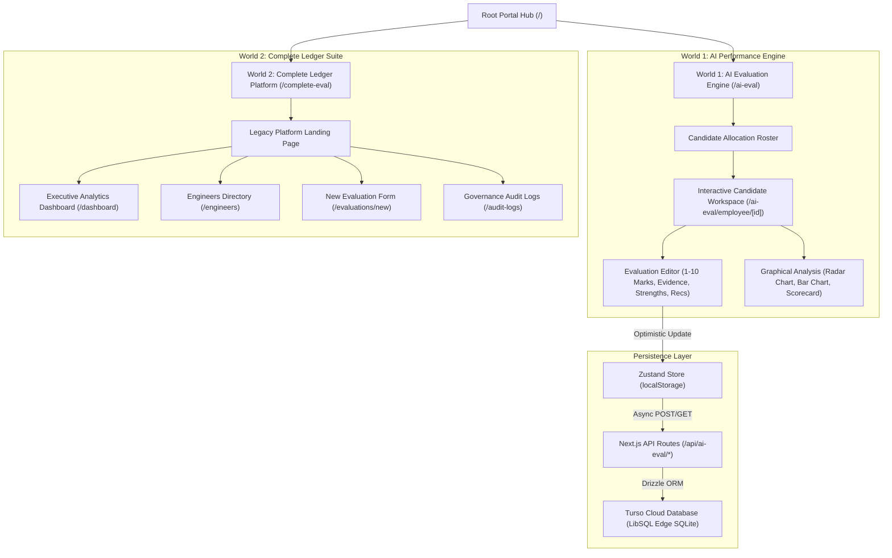
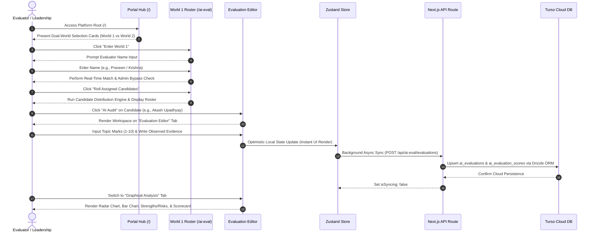
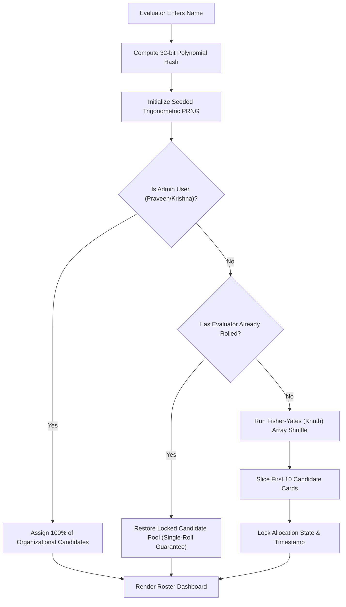
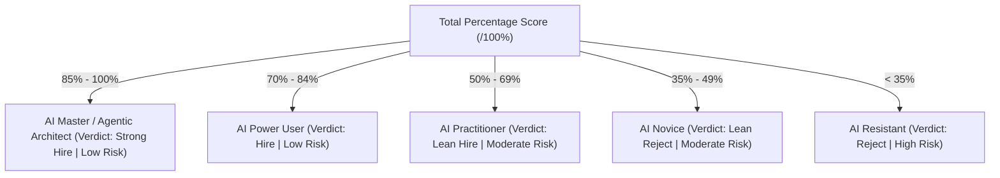
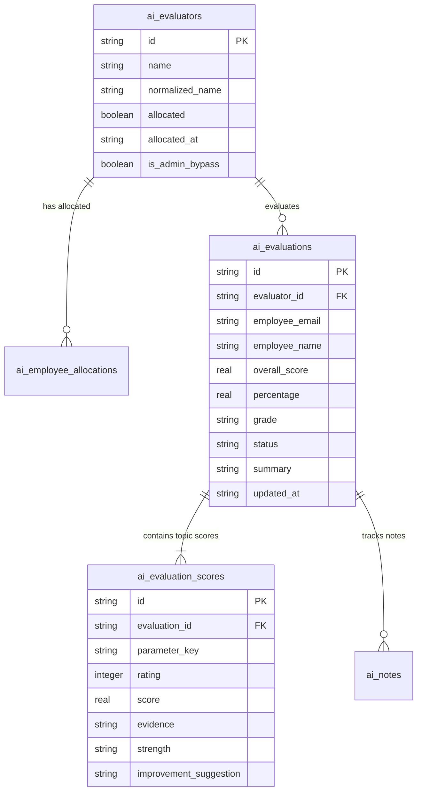

# Wysbryx Intelligence Platform — Dual-World Performance Engine

> **Next-Gen Engineering Performance Intelligence Platform**  
> Transparent, data-driven candidate evaluation engine pairing an **AI Competency Workspace** (World 1) with the **Complete Engineering Ledger** (World 2). Built with Next.js 15, React 19, TypeScript, Zustand, Drizzle ORM, and Turso Edge SQLite.

---

## 📑 Table of Contents
1. [Executive Overview & Purpose](#1-executive-overview--purpose)
2. [Dual-World Isolated Architecture](#2-dual-world-isolated-architecture)
3. [End-to-End User Flow & Sequence Diagram](#3-end-to-end-user-flow--sequence-diagram)
4. [Candidate Allocation Engine & Algorithm Deep-Dive](#4-candidate-allocation-engine--algorithm-deep-dive)
5. [World 1: AI Evaluation Engine & Rubrics](#5-world-1-ai-evaluation-engine--rubrics)
6. [World 2: Complete Engineering Ledger Suite](#6-world-2-complete-engineering-ledger-suite)
7. [Database & Persistence Architecture (Turso + Drizzle ORM)](#7-database--persistence-architecture-turso--drizzle-orm)
8. [Local Development & Setup Guide](#8-local-development--setup-guide)
9. [Deployment & Environment Configuration](#9-deployment--environment-configuration)

---

## 1. Executive Overview & Purpose

Wysbryx Intelligence eliminates subjective bias, recency bias, and arbitrary scoring in engineering evaluations. The platform adheres strictly to a **Zero-Surveillance Policy**—rejecting keystroke tracking, idle screen monitoring, or camera surveillance—focusing 100% on verifiable deliverables, code quality, AI velocity multipliers, and team mentorship.

### Core Architecture Highlights
* **Dual-World Isolation**: Clear division between **World 1** (AI Performance Engine) and **World 2** (Legacy Ledger Platform).
* **Deterministic Single-Roll Distribution**: Candidates are assigned to evaluators using a seeded pseudo-random algorithm, ensuring fair workload partitioning.
* **Server-Side DB Persistence**: Evaluations update instantly in local state via Zustand optimistic updates while background-syncing to **Turso Edge SQLite** via **Drizzle ORM**.
* **Dynamic Scorecards & Analytics**: Real-time SVG circular gauges, polygon radar contour charts, horizontal marks breakdown, strengths/risks isolation, and hover-enabled evidence review grids.

---

## 2. Dual-World Isolated Architecture



---

## 3. End-to-End User Flow & Sequence Diagram



---

## 4. Candidate Allocation Engine & Algorithm Deep-Dive

### The Allocation Problem
In traditional evaluation systems, evaluators often cherry-pick candidates or experience unequal workload distribution. Wysbryx solves this with a **Deterministic Seeded Single-Roll Allocation Engine**.



### Algorithm Breakdown

#### Step 1: 32-bit Polynomial String Hashing
The evaluator's normalized name string is converted into a 32-bit integer seed hash:
$$\text{hash} = \sum_{i=0}^{n-1} \left( (\text{hash} \ll 5) - \text{hash} + \text{charCodeAt}(i) \right)$$

```typescript
export function generateSeededHash(str: string): number {
  let hash = 0;
  for (let i = 0; i < str.length; i++) {
    const char = str.charCodeAt(i);
    hash = (hash << 5) - hash + char;
    hash |= 0;
  }
  return Math.abs(hash);
}
```

#### Step 2: Seeded Trigonometric Pseudo-Random Generator (PRNG)
Instead of volatile `Math.random()`, the engine uses a trigonometric PRNG function so that **the exact same evaluator name always yields the exact same candidate sequence**:
$$f(\text{seed}) = |\sin(\text{seed}) \times 10000| - \lfloor |\sin(\text{seed}) \times 10000| \rfloor$$

```typescript
function seededRandom(seed: number) {
  const x = Math.sin(seed++) * 10000;
  return x - Math.floor(x);
}
```

#### Step 3: Fisher-Yates (Knuth) Shuffle Algorithm
The candidate array is shuffled in $O(N)$ linear time by swapping elements backward from index $N-1$ down to 1:

```typescript
let currentSeed = hashSeed;
for (let i = candidatesCopy.length - 1; i > 0; i--) {
  const j = Math.floor(seededRandom(currentSeed++) * (i + 1));
  [candidatesCopy[i], candidatesCopy[j]] = [candidatesCopy[j], candidatesCopy[i]];
}
```

#### Step 4: Partition Slicing & Single-Roll Lock
The shuffled array is sliced to return 10 candidate cards (`candidatesCopy.slice(0, 10)`). Once rolled:
- **`isAllocated`** is set to `true`.
- **`allocatedAt`** logs the exact ISO timestamp.
- **Single-Roll Rule**: If the user reloads or logs back in, `performRoll()` checks `if (isAllocated) return;` and preserves their exact assigned candidates. Re-rolling is blocked to prevent workload manipulation.
- **Admin Bypass**: Designated leadership profiles (`Praveen`, `Krishna`) automatically bypass the 10-candidate slice limit and receive access to **100% of all engineers**.

---

## 5. World 1: AI Evaluation Engine & Rubrics

### The 6 Standardized AI Competency Rubrics

| Topic # | Parameter Name | Rubric Evaluation Focus | Score Range |
|---|---|---|---|
| **1** | **Prompt Engineering & Context** | Multi-turn system prompts, role definition, context boundary setting, zero/few-shot examples, and JSON schema enforcement. | `1 - 10 Marks` |
| **2** | **Code Generation & Verification** | Reviewing AI-generated code via lint checks, type safety verification, and boundary condition unit tests. | `1 - 10 Marks` |
| **3** | **AI-Assisted Debugging** | Feeding sanitized stack traces/logs to LLMs, rapid root cause analysis, and memory leak resolution velocity. | `1 - 10 Marks` |
| **4** | **AI Workflow & Velocity** | Deep IDE integration (Cursor, Claude, Copilot), custom keyboard shortcuts, CLI automation, and speedup multipliers (~3.2x). | `1 - 10 Marks` |
| **5** | **AI Systems & Agentic Design** | Function calling schemas, RAG retrieval pipelines, vector database tuning, and autonomous agent loops. | `1 - 10 Marks` |
| **6** | **AI Safety, Ethics & Security** | Zero-secret compliance (scrubbing API keys/JWTs/PII before prompts), `.env` abstractions, and OWASP LLM security awareness. | `1 - 10 Marks` |

---

### Automatic Grade Tiers & Risk Classification

Total marks earned across graded topics out of 60 possible points are converted to an overall percentage score out of 100:



---

## 6. World 2: Complete Engineering Ledger Suite

World 2 preserves the legacy platform intact at `/complete-eval` and `/dashboard`:

* **Restored Platform Landing (`/complete-eval`)**: Features the Hero section (*"Engineering Performance Intelligence Platform"*), 4 interactive metric cards (128 Completed, 87.4/100 Org Average, 8 Parameters, 100% Evidence), methodology architecture tabs, FAQ accordions, zero-surveillance footer, and bottom floating dock.
* **8 Standardized Parameters**: Technical Knowledge (15%), Code Quality (15%), Problem Solving (15%), Responsible AI (10%), Communication (10%), Delivery (10%), Team Mentorship (15%), Learning (10%).
* **90-Day Recency Bias Mitigation**: Evaluators review deliverables across the full 90-day quarter rather than recent weeks.
* **Mandatory PR & Artifact Proof**: No rating can be saved without attached pull request links or architecture spec URLs.

---

## 7. Database & Persistence Architecture (Turso + Drizzle ORM)

All evaluations update local state optimistically via Zustand while persisting server-side to **Turso Cloud (LibSQL Edge SQLite)**.



---

## 8. Local Development & Setup Guide

### Prerequisites
* **Node.js**: `v18.0.0` or higher
* **npm**: `v9.0.0` or higher

### Installation & Run

1. **Clone Repository & Install Dependencies**:
   ```bash
   git clone https://github.com/akshaykumar33/Wysbryx-Ledger.git
   cd Ledger
   npm install
   ```

2. **Configure Environment Variables**:
   Create a `.env.local` file in the root directory:
   ```env
   TURSO_DATABASE_URL=libsql://your-db-name.turso.io
   TURSO_AUTH_TOKEN=your-turso-auth-token
   ```

3. **Push Database Schema to Turso**:
   ```bash
   npx drizzle-kit push
   ```

4. **Start Development Server**:
   ```bash
   npm run dev
   ```
   Open [http://localhost:3000](http://localhost:3000) in your browser.

---

## 9. Deployment & Environment Configuration

To deploy to **Vercel**:

1. Push your branch to GitHub (`staging` or `main`).
2. Connect your repository in Vercel.
3. In **Project Settings → Environment Variables**, add:
   * `TURSO_DATABASE_URL`
   * `TURSO_AUTH_TOKEN`
4. Deploy! The application will automatically execute with full server-side persistence.

---

*Built with ❤️ by Wysbryx Technologies. Enterprise Grade · Zero Interference · Built for Engineering Excellence.*
